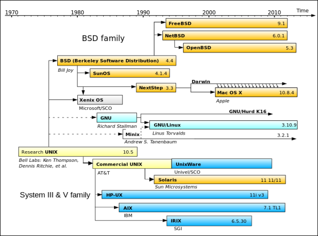
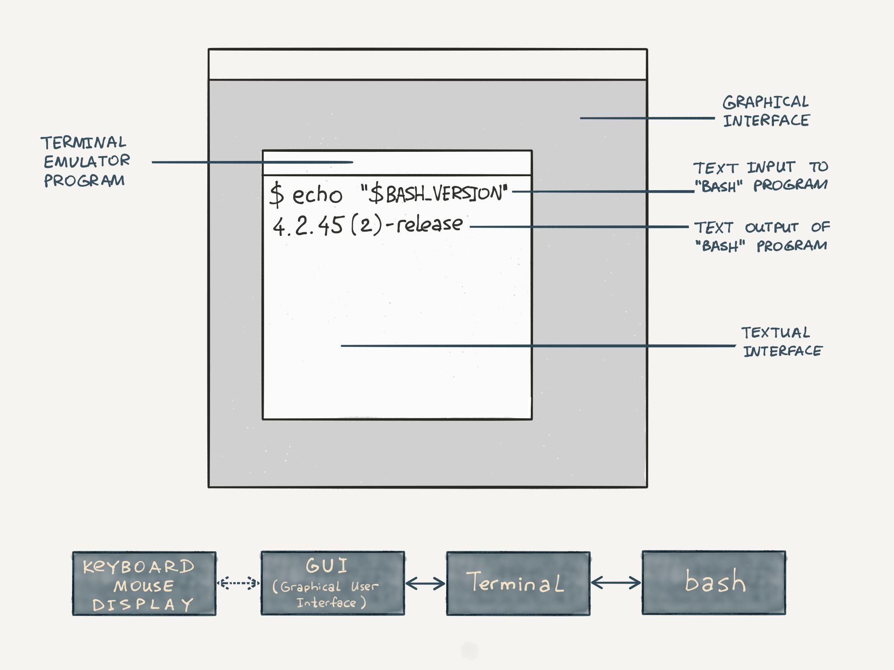
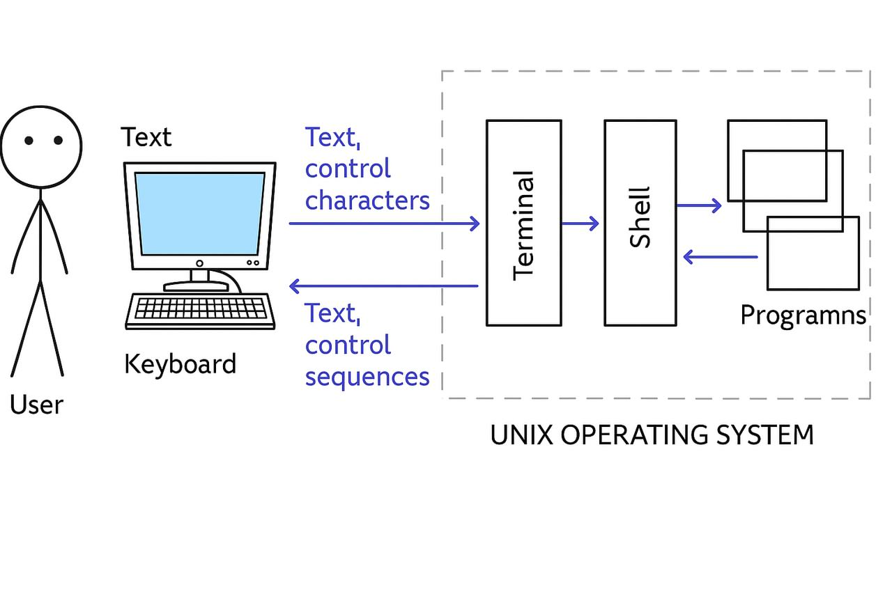

# Table of Contents
- [Introduction](#introduction)
- [Operating Systems](#operating-systems)
- [Command Line](#command-line)
- [Navigation](#navigation)
- [Command Line Interface](#command-line-interface)
- [File Structure](#file-structure)
- [Reading Files](#reading-files)
- [Grep](#grep)
- [Editing Files](#editing-files)
- [Streams](#streams)
- [Pipelines](#pipelines)
- [Manipulating File Structure](#manipulating-file-structure)
- [Environment Variables](#environment-variables)
- [History](#history)
- [Users and Groups](#users-and-groups)
- [Sudo](#sudo)
- [Access Rights](#access-rights)
- [Package Manager](#package-manager)
- [Execution of Programs](#execution-of-programs)

# Intorduction
Server-side environment is usually managed throught terminal which provides text-based interface for interacting with machine.
It may first seem archaic, but text-based communication with computers have several benefits:
- significantly saves resources 
- allows to automate any actions
- provides virtually unlimited access to system's capabilities
- generally opens more possibilities in many programs

# Operating Systems
## How the command line came into being
**Unix** - an operating system, born in 1970s, firstly designed to run on mainframes.
One of the key features of Unix was multi-user mode.
Unix turned out very successful, but it was closed-source.
Later, they were systems based on unix, but they weren't backward compatitable, which made it very difficult, so, the POSIX was born.  
**POSIX** *(Portable Operating System Interface for Unix)* - family of standards specified to maintain compatibility between Unix-like operating systems.
## Linux Operating System
**Linux** - operating system kernel.  

Linux is not used in its pure form, because you need several components to have a full-fledged OS.
These are called distributions.
A distribution includes:
- Linux kernel itself
- GNU programs
- Utilities for installing and configuring linux
- Support for regular updates of the kernel and its environment
## Additional materials
[Books on operating systems](../recommendations/operating_systems.md)

# Command line
To work with command line, we need two things:
- terminal
- command line shell
## Terminal
**Terminal** - program that emulates the behavior of a hardware terminal consisting of a keyboard and a monitor.
## Command shell
**A command shell** - a program through which a user or administrator manages the operating system and installed programs using the command line.

*The terminal is just a program that runs the command shell inside itself*

The command shell is often called a **REPL** *(Read-Eval-Print-Loop)*.
## Additional material
[Tilix](https://gnunn1.github.io/tilix-web/) - advanced terminal.
# Navigation
# Command line interface
# File structure
# Reading files
# Grep
# Editing files
# Streams
# Pipelines
# Manipulating file structre
# Environment variables
# History
# Users and Groups
# Sudo
# Acess rights
# Package manager 
# Execution of programs 
